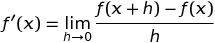

Let us begin with the definition of derivatives 
via the Difference Quotient(DQ). It is expressed 
as follows:

Simply put, you take the function plus an 
infinitely small number h, subtract it from 
the original function, and then divide the 
function by h. The hope of this is to determine 
the slope of a curve at any given point. The 
intuition here is that given two points on a 
curve and finding their slope gives you a more 
approximate slope of a curve at a given point the 
closer they get together. So, if the second point 
is infinitely small (h) from x, the slope 
between x and x+h would be the slope of x.
